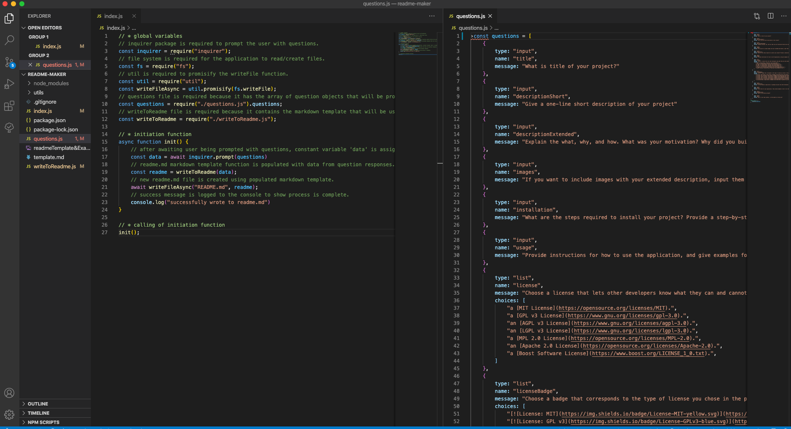
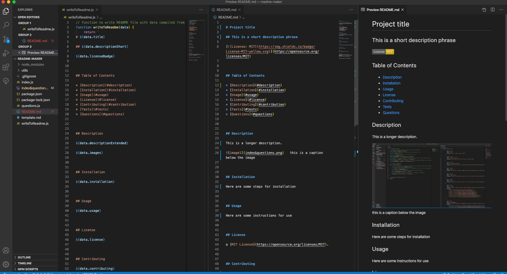

# README MAKER

## An easy way to complete a structured readme.md file  

  

## Table of Contents

* [Description](#description)
* [Installation](#installation)
* [Usage](#usage)
* [License](#license)
* [Contributing](#contribution)
* [Tests](#tests)
* [Questions](#questions)

## Description 

This is a simple application that guides you through the process of creating a structured readme. I made it to experiment with node.js, but also because I don't like having to put much thought into what goes into creating and structuring a readme file. So essentially, it just takes me through the content sections step by step, and then structures it for me. As long as I answer the questions, it produces a formatted readme file on the other end.    

   The above image is of the index.js file on the left, and then the modularized questions.js file on the right which contains the question used by the inquirer package.      This image shows you the writeToReadme function, along with a generated (example) readme.md file, and a preview of it.  

## Installation

To install, make sure you have the package.json initiated, along with the dependencies installed (e.g. npm inquirer ). Then just open terminal and execute 'node index.js'

## Usage 

After installation, and using node to execute the index.js file, just let the application guide you through the process of answering each question. If you have images you want included, make sure these are included in any folders pushed to Github. When the readme file is generated, copy and paste it, along with any accompanying images, to your project files.  

## License

a [MIT License](https://opensource.org/licenses/MIT).

## Contributing

Feel free to contribute or give me suggestions for improvement at my email below.

## Tests

I don't have any tests at present.

## Questions

Got questions? Feel free to contact me.  
Github username: [domjparker](https://github.com/domjparker)  
Email address: dominic.j.parker@gmail.com

---

© 2020, Dominic Parker. All Rights Reserved.

